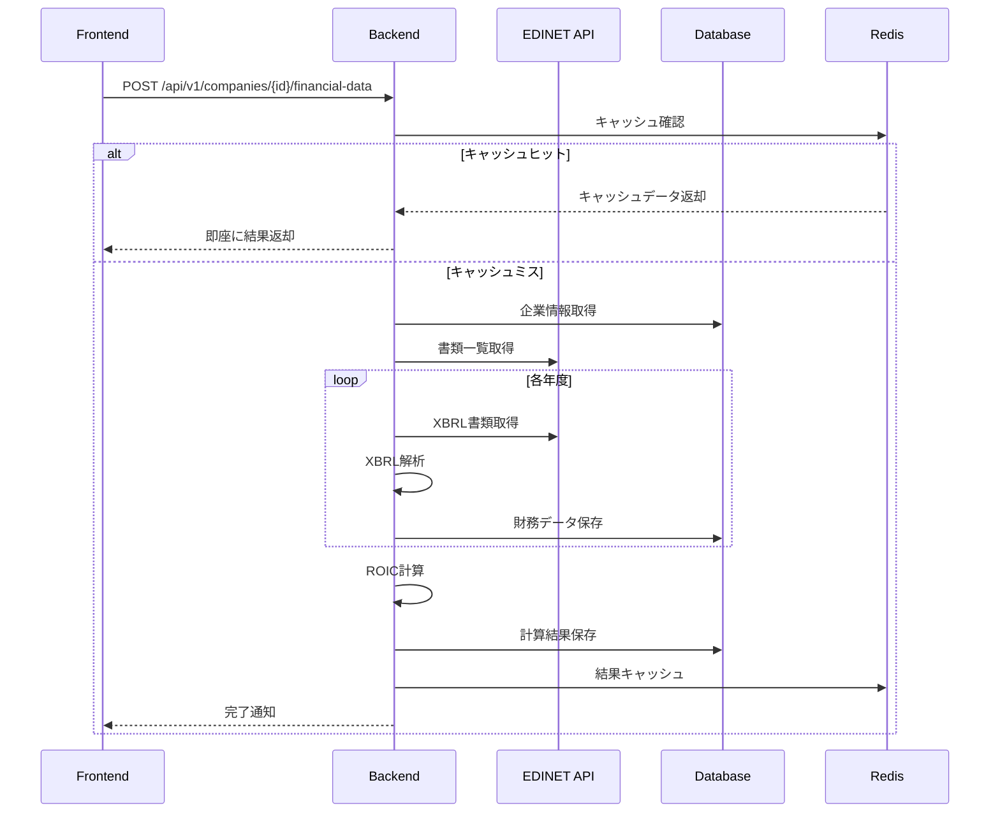

# EDINET API実装設計書

## 1. 概要

### 1.1 目的
要件定義書（F-002: 有価証券報告書自動取得機能）とROIC計算仕様書に基づき、EDINET APIを使用した財務データ取得システムの実装設計を定める。

### 1.2 要件再確認
- **F-002**: 企業選択後、複数年分（最低3年分）の有価証券報告書を自動取得
- **NF-001**: ROIC計算 1企業あたり3秒以内
- **データ要件**: ROIC計算に必要な財務データ項目の自動抽出

## 2. システムアーキテクチャ

### 2.1 全体構成
```
┌─────────────┐    ┌──────────────┐    ┌─────────────┐
│   Next.js   │───▶│   Node.js    │───▶│   EDINET    │
│  Frontend   │    │   Backend    │    │     API     │
└─────────────┘    └──────────────┘    └─────────────┘
                            │
                    ┌──────────────┐
                    │ PostgreSQL   │
                    │   Database   │
                    └──────────────┘
```

### 2.2 技術スタック
- **バックエンド**: Node.js + Express.js
- **データベース**: PostgreSQL + Redis（キャッシュ）
- **外部API**: EDINET API v2
- **データ処理**: XBRL解析ライブラリ

## 3. EDINET API仕様

### 3.1 API概要
- **提供元**: 金融庁
- **ベースURL**: `https://api.edinet-fsa.go.jp/api/v2/`
- **認証**: APIキー必須（無料取得可能）
- **レート制限**: 要確認（API仕様に従う）

### 3.2 主要エンドポイント

#### 3.2.1 書類一覧API
```http
GET /api/v2/documents.json
Parameters:
  - date: YYYY-MM-DD（検索対象日）
  - type: 1（有価証券報告書）
```

#### 3.2.2 書類取得API
```http
GET /api/v2/documents/{docId}
Parameters:
  - type: 1（XBRL形式）
```

## 4. データベース設計

### 4.1 テーブル設計

#### 4.1.1 企業マスタテーブル
```sql
CREATE TABLE companies (
    id SERIAL PRIMARY KEY,
    edinet_code VARCHAR(6) UNIQUE NOT NULL,    -- EDINETコード
    ticker_symbol VARCHAR(10) UNIQUE,          -- 証券コード
    company_name VARCHAR(255) NOT NULL,        -- 企業名
    company_name_en VARCHAR(255),              -- 英語企業名
    industry_code VARCHAR(10),                 -- 業種コード
    market_cap DECIMAL(15,2),                  -- 時価総額
    created_at TIMESTAMP DEFAULT CURRENT_TIMESTAMP,
    updated_at TIMESTAMP DEFAULT CURRENT_TIMESTAMP
);
```

#### 4.1.2 EDINET書類管理テーブル
```sql
CREATE TABLE edinet_documents (
    id SERIAL PRIMARY KEY,
    company_id INTEGER REFERENCES companies(id),
    doc_id VARCHAR(50) UNIQUE NOT NULL,        -- EDINET書類管理番号
    edinet_code VARCHAR(6) NOT NULL,           -- EDINETコード
    document_type VARCHAR(50),                 -- 書類種別
    fiscal_year INTEGER NOT NULL,              -- 決算年度
    period_end DATE,                           -- 決算期末日
    submitted_date DATE,                       -- 提出日
    xbrl_file_path TEXT,                      -- XBRLファイル保存パス
    processing_status VARCHAR(20) DEFAULT 'pending', -- pending/processing/completed/error
    created_at TIMESTAMP DEFAULT CURRENT_TIMESTAMP,
    UNIQUE(company_id, fiscal_year)
);
```

#### 4.1.3 財務データテーブル
```sql
CREATE TABLE financial_statements (
    id SERIAL PRIMARY KEY,
    company_id INTEGER REFERENCES companies(id),
    fiscal_year INTEGER NOT NULL,
    document_id INTEGER REFERENCES edinet_documents(id),
    
    -- 損益計算書項目
    net_sales DECIMAL(15,2),                   -- 売上高
    gross_profit DECIMAL(15,2),                -- 売上総利益
    operating_income DECIMAL(15,2),            -- 営業利益
    selling_admin_expenses DECIMAL(15,2),      -- 販管費
    
    -- 貸借対照表項目
    trade_receivables DECIMAL(15,2),           -- 売上債権
    inventories DECIMAL(15,2),                 -- 棚卸資産
    trade_payables DECIMAL(15,2),              -- 仕入債務
    property_plant_equipment DECIMAL(15,2),    -- 固定資産
    total_assets DECIMAL(15,2),                -- 総資産
    
    -- メタデータ
    accounting_standard VARCHAR(20),            -- 会計基準（JGAAP/IFRS）
    consolidation_type VARCHAR(20),            -- 連結/単体
    extraction_metadata JSONB,                 -- 抽出時のメタデータ
    
    created_at TIMESTAMP DEFAULT CURRENT_TIMESTAMP,
    UNIQUE(company_id, fiscal_year)
);
```

#### 4.1.4 ROIC計算結果テーブル
```sql
CREATE TABLE roic_calculations (
    id SERIAL PRIMARY KEY,
    company_id INTEGER REFERENCES companies(id),
    fiscal_year INTEGER NOT NULL,
    
    -- ROIC構成要素
    roic_percentage DECIMAL(8,4) NOT NULL,     -- ROIC（%）
    invested_capital DECIMAL(15,2),            -- 投下資本
    capital_turnover DECIMAL(8,4),             -- 投下資本回転率
    operating_margin DECIMAL(8,4),             -- 営業利益率
    
    -- 詳細分解
    gross_margin DECIMAL(8,4),                 -- 粗利率
    admin_expense_ratio DECIMAL(8,4),          -- 販管費率
    working_capital DECIMAL(15,2),             -- 運転資本
    working_capital_turnover DECIMAL(8,4),     -- 運転資本回転率
    fixed_asset_turnover DECIMAL(8,4),         -- 固定資産回転率
    
    calculation_metadata JSONB,                -- 計算詳細情報
    calculated_at TIMESTAMP DEFAULT CURRENT_TIMESTAMP,
    UNIQUE(company_id, fiscal_year)
);
```

## 5. API実装設計

### 5.1 バックエンドAPI設計

#### 5.1.1 企業検索API
```typescript
// GET /api/v1/companies/search?q={query}
interface CompanySearchResponse {
  companies: {
    id: number;
    edinetCode: string;
    tickerSymbol?: string;
    companyName: string;
    companyNameEn?: string;
    industryCode?: string;
  }[];
}
```

#### 5.1.2 財務データ取得API
```typescript
// POST /api/v1/companies/{id}/financial-data
interface FinancialDataRequest {
  years: number[];  // 取得対象年度
  forceRefresh?: boolean;  // キャッシュ無視
}

interface FinancialDataResponse {
  companyId: number;
  processingStatus: 'pending' | 'processing' | 'completed' | 'error';
  data: FinancialStatement[];
  errors?: string[];
}
```

#### 5.1.3 ROIC計算API
```typescript
// POST /api/v1/companies/{id}/roic
interface ROICCalculationRequest {
  years: number[];
  includeDetails: boolean;
}

interface ROICCalculationResponse {
  companyId: number;
  calculations: ROICResult[];
}

interface ROICResult {
  fiscalYear: number;
  roic: number;
  investedCapital: number;
  capitalTurnover: number;
  operatingMargin: number;
  details: {
    grossMargin: number;
    adminExpenseRatio: number;
    workingCapitalTurnover: number;
    fixedAssetTurnover: number;
  };
}
```

### 5.2 EDINET API連携モジュール

#### 5.2.1 EDINETクライアント
```typescript
class EDINETClient {
  private apiKey: string;
  private baseURL: string = 'https://api.edinet-fsa.go.jp/api/v2';
  
  constructor(apiKey: string) {
    this.apiKey = apiKey;
  }

  // 企業の書類一覧取得
  async getDocumentList(edinetCode: string, years: number[]): Promise<DocumentInfo[]> {
    // 実装詳細
  }

  // 書類内容取得（XBRL）
  async getDocument(docId: string): Promise<Buffer> {
    // 実装詳細
  }
}
```

#### 5.2.2 XBRL解析モジュール
```typescript
class XBRLParser {
  // XBRL from financial data extraction
  parseFinancialData(xbrlContent: Buffer): FinancialData {
    // XBRLから財務データ項目を抽出
    return {
      netSales: this.extractValue('NetSales'),
      grossProfit: this.extractValue('GrossProfit'),
      operatingIncome: this.extractValue('OperatingIncome'),
      // ... 他の項目
    };
  }

  private extractValue(tag: string): number | null {
    // XBRL taxonomyに基づく値抽出
  }
}
```

### 5.3 ROIC計算エンジン

```typescript
class ROICCalculator {
  calculate(financialData: FinancialData): ROICResult {
    // 投下資本計算
    const investedCapital = 
      financialData.tradeReceivables +
      financialData.inventories +
      financialData.tradePayables +
      financialData.propertyPlantEquipment;

    // 投下資本回転率
    const capitalTurnover = financialData.netSales / investedCapital;

    // 営業利益率
    const operatingMargin = financialData.operatingIncome / financialData.netSales;

    // ROIC
    const roic = capitalTurnover * operatingMargin;

    return {
      roic: roic * 100, // パーセント表示
      investedCapital,
      capitalTurnover,
      operatingMargin: operatingMargin * 100,
      details: this.calculateDetails(financialData)
    };
  }

  private calculateDetails(data: FinancialData) {
    // 詳細分解計算
    return {
      grossMargin: (data.grossProfit / data.netSales) * 100,
      adminExpenseRatio: (data.sellingAdminExpenses / data.netSales) * 100,
      workingCapitalTurnover: this.calculateWorkingCapitalTurnover(data),
      fixedAssetTurnover: data.netSales / data.propertyPlantEquipment
    };
  }
}
```

## 6. 処理フロー設計

### 6.1 財務データ取得フロー



### 6.2 リアルタイム進捗表示

```typescript
// WebSocket または Server-Sent Events
class ProgressTracker {
  private clients: Map<string, WebSocket> = new Map();

  notifyProgress(sessionId: string, progress: ProgressUpdate) {
    const client = this.clients.get(sessionId);
    if (client) {
      client.send(JSON.stringify({
        type: 'progress',
        data: progress
      }));
    }
  }
}

interface ProgressUpdate {
  stage: 'fetching_documents' | 'parsing_xbrl' | 'calculating_roic' | 'completed';
  progress: number; // 0-100
  currentYear?: number;
  message: string;
}
```

## 7. エラーハンドリング

### 7.1 EDINET API関連エラー

```typescript
class EDINETAPIError extends Error {
  constructor(
    public statusCode: number,
    public message: string,
    public edinetCode?: string
  ) {
    super(message);
  }
}

// エラー種別
enum EDINETErrorType {
  RATE_LIMIT_EXCEEDED = 'RATE_LIMIT_EXCEEDED',
  DOCUMENT_NOT_FOUND = 'DOCUMENT_NOT_FOUND',
  INVALID_EDINET_CODE = 'INVALID_EDINET_CODE',
  XBRL_PARSE_ERROR = 'XBRL_PARSE_ERROR'
}
```

### 7.2 リトライ機構

```typescript
class RetryHandler {
  async executeWithRetry<T>(
    operation: () => Promise<T>,
    maxRetries: number = 3,
    delay: number = 1000
  ): Promise<T> {
    let lastError: Error;
    
    for (let i = 0; i <= maxRetries; i++) {
      try {
        return await operation();
      } catch (error) {
        lastError = error;
        if (i < maxRetries) {
          await this.delay(delay * Math.pow(2, i)); // Exponential backoff
        }
      }
    }
    
    throw lastError;
  }
}
```

## 8. パフォーマンス最適化

### 8.1 キャッシュ戦略

```typescript
// Redis キャッシュ設定
const CACHE_KEYS = {
  FINANCIAL_DATA: (companyId: number, year: number) => 
    `financial:${companyId}:${year}`,
  ROIC_RESULT: (companyId: number, year: number) => 
    `roic:${companyId}:${year}`,
  DOCUMENT_LIST: (edinetCode: string) => 
    `documents:${edinetCode}`
};

const CACHE_TTL = {
  FINANCIAL_DATA: 86400 * 30, // 30日
  ROIC_RESULT: 86400 * 7,     // 7日
  DOCUMENT_LIST: 86400        // 1日
};
```

### 8.2 並列処理

```typescript
class ParallelProcessor {
  async processMultipleYears(
    edinetCode: string, 
    years: number[],
    concurrency: number = 3
  ): Promise<FinancialData[]> {
    const chunks = this.chunkArray(years, concurrency);
    const results: FinancialData[] = [];
    
    for (const chunk of chunks) {
      const promises = chunk.map(year => 
        this.processYear(edinetCode, year)
      );
      const chunkResults = await Promise.all(promises);
      results.push(...chunkResults);
    }
    
    return results;
  }
}
```

## 9. セキュリティ対策

### 9.1 APIキー管理

```typescript
// 環境変数による管理
const config = {
  edinetApiKey: process.env.EDINET_API_KEY,
  apiUrl: process.env.EDINET_API_URL || 'https://api.edinet-fsa.go.jp/api/v2'
};

// APIキー検証
class APIKeyValidator {
  validate(apiKey: string): boolean {
    return apiKey && apiKey.length > 0;
  }
}
```

### 9.2 レート制限対応

```typescript
class RateLimiter {
  private requests: number[] = [];
  private maxRequests: number = 100; // 仮定値
  private timeWindow: number = 3600000; // 1時間

  async checkLimit(): Promise<boolean> {
    const now = Date.now();
    this.requests = this.requests.filter(time => now - time < this.timeWindow);
    
    if (this.requests.length >= this.maxRequests) {
      throw new Error('Rate limit exceeded');
    }
    
    this.requests.push(now);
    return true;
  }
}
```

## 10. テスト設計

### 10.1 単体テスト

```typescript
describe('ROIC Calculator', () => {
  test('正常なROIC計算', () => {
    const calculator = new ROICCalculator();
    const testData: FinancialData = {
      netSales: 100000,
      operatingIncome: 10000,
      tradeReceivables: 15000,
      inventories: 8000,
      tradePayables: 12000,
      propertyPlantEquipment: 20000
    };
    
    const result = calculator.calculate(testData);
    expect(result.roic).toBeCloseTo(18.18, 2);
  });
});
```

### 10.2 統合テスト

```typescript
describe('EDINET API Integration', () => {
  test('書類一覧取得', async () => {
    const client = new EDINETClient(process.env.TEST_API_KEY!);
    const documents = await client.getDocumentList('E00001', [2023]);
    
    expect(documents).toHaveLength(1);
    expect(documents[0].fiscalYear).toBe(2023);
  });
});
```

## 11. 運用・監視

### 11.1 ログ設計

```typescript
import winston from 'winston';

const logger = winston.createLogger({
  level: 'info',
  format: winston.format.combine(
    winston.format.timestamp(),
    winston.format.json()
  ),
  transports: [
    new winston.transports.File({ filename: 'edinet-api.log' }),
    new winston.transports.Console()
  ]
});

// 使用例
logger.info('EDINET API request', {
  edinetCode: 'E00001',
  docId: 'S1234567',
  operation: 'getDocument'
});
```

### 11.2 メトリクス収集

```typescript
class MetricsCollector {
  private static instance: MetricsCollector;
  private metrics = {
    apiRequests: 0,
    processingTime: [] as number[],
    errors: 0
  };

  recordAPIRequest(duration: number) {
    this.metrics.apiRequests++;
    this.metrics.processingTime.push(duration);
  }

  recordError() {
    this.metrics.errors++;
  }

  getAverageProcessingTime(): number {
    const times = this.metrics.processingTime;
    return times.reduce((a, b) => a + b, 0) / times.length;
  }
}
```

## 12. 今後の拡張計画

### 12.1 Phase 1 対応範囲
- EDINET API基本連携
- ROIC基本計算
- 3年分データ取得

### 12.2 Phase 2 拡張計画
- 四半期データ対応
- 業界別ROIC比較
- データ品質チェック機能

### 12.3 Phase 3 高度化
- 機械学習による異常値検出
- 予測ROIC計算
- 国際会計基準対応

---

**実装優先度**: High  
**完了予定**: Phase 1（MVP）から順次実装  
**責任者**: 開発チーム  
**レビュー**: 技術スタック決定後、データベース設計と並行実装